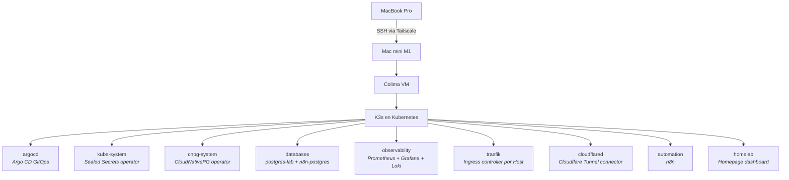
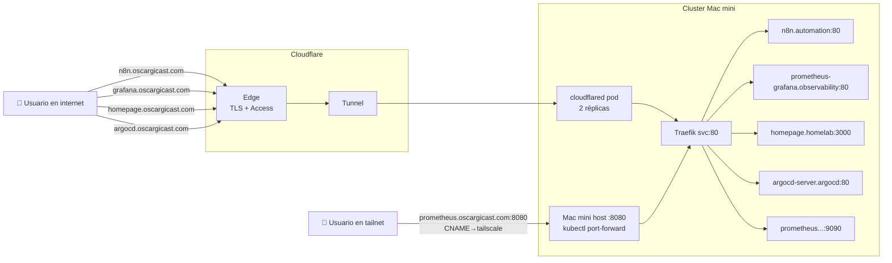

# Homelab Kubernetes — Mac mini M1

Laboratorio Kubernetes personal corriendo en una **Mac mini M1 headless**, gestionado con **GitOps (Argo CD)** y expuesto al mundo vía **Cloudflare Tunnel** sobre el dominio `oscargicast.com`.

## Stack en el cluster



## Cómo se accede a cada servicio



## Cómo funciona el GitOps

Patrón **App of Apps** de Argo CD. Hacer push a `main` es suficiente para que los cambios se apliquen al cluster automáticamente.

```
git push → Argo CD detecta el cambio → aplica al cluster
```

El único `kubectl apply` manual es el bootstrap inicial:

```bash
kubectl apply -f bootstrap/argocd/root-app.yaml
```

## Stack

| Componente | Rol | Namespace |
|---|---|---|
| Argo CD | GitOps controller | `argocd` |
| Sealed Secrets | Credenciales encriptadas en Git | `kube-system` |
| CloudNativePG | Operador PostgreSQL | `cnpg-system` |
| postgres-lab | PostgreSQL de pruebas | `databases` |
| n8n-postgres | PostgreSQL dedicado para n8n | `databases` |
| kube-prometheus-stack | Métricas (Prometheus + Grafana) | `observability` |
| Loki | Logs centralizados | `observability` |
| Traefik | Ingress controller (routing por Host) | `traefik` |
| cloudflared | Cloudflare Tunnel connector (saliente) | `cloudflared` |
| n8n | Automatización de workflows | `automation` |
| Homepage | Dashboard visual del homelab | `homelab` |

## Estructura del repo

```
homelab-k8s/
├── bootstrap/argocd/root-app.yaml      # bootstrap manual (una sola vez)
├── clusters/mac-mini/                  # Apps de nivel cluster
│   ├── apps.yaml                       # databases + automation + homelab
│   ├── infrastructure.yaml             # namespaces + operadores + cloudflared
│   └── observability.yaml
├── infrastructure/
│   ├── namespaces/                     # Namespace CRs
│   ├── sealed-secrets/                 # Sealed Secrets operator
│   ├── cloudnative-pg/                 # CNPG operator
│   ├── traefik/                        # Traefik ingress controller
│   ├── cloudflared/                    # CF Tunnel: deployment + sealed-secret + Application
│   └── argocd-config/                  # argocd-cmd-params-cm overrides
├── databases/
│   ├── postgres-lab/                   # cluster.yaml + sealed-secret.yaml
│   └── n8n-postgres/
├── observability/
│   ├── prometheus/                     # values.yaml + ingresses (grafana, prometheus)
│   ├── loki/                           # values.yaml
│   └── grafana-dashboards/             # ConfigMaps con dashboards (CNPG)
├── automation/n8n/                     # values.yaml + ingress-public.yaml
├── homelab/homepage/                   # values.yaml + ingress-public.yaml
└── docs/runbooks/                      # runbooks de operación
```

## Gestión de secrets

Los secrets se encriptan con **Sealed Secrets** antes de commitearlos. El archivo `secret.yaml` está en `.gitignore` — nunca va a Git.

```bash
# Flujo para agregar un secret:
kubeseal --cert ~/.config/homelab-k8s-sealed-secrets-pub.pem \
  --format yaml < secret.yaml > sealed-secret.yaml

git add sealed-secret.yaml && git commit -m "feat: add sealed secret"
rm secret.yaml  # borrar el plaintext
```

## Bootstrap (primera vez)

```bash
# 1. Instalar Argo CD en Mac mini (--server-side evita error de annotation demasiado larga)
kubectl create namespace argocd
kubectl apply --server-side -n argocd -f \
  https://raw.githubusercontent.com/argoproj/argo-cd/stable/manifests/install.yaml

# 2. Instalar kubeseal y obtener el cert
brew install kubeseal
kubeseal --fetch-cert \
  --controller-namespace kube-system \
  --controller-name sealed-secrets-controller \
  > ~/.config/homelab-k8s-sealed-secrets-pub.pem

# 3. Sellar los secrets de las bases de datos
# Ver CLAUDE.md para el flujo completo

# 4. Aplicar el root Application (único apply manual)
kubectl apply -f bootstrap/argocd/root-app.yaml
```

## Acceder a los servicios

| Servicio | URL | Acceso |
|---|---|---|
| n8n | `https://n8n.oscargicast.com` | Público (auth propia) |
| Grafana | `https://grafana.oscargicast.com` | Público + Cloudflare Access |
| Homepage | `https://homepage.oscargicast.com` | Público + Cloudflare Access |
| Argo CD | `https://argocd.oscargicast.com` | Público + Cloudflare Access (+ admin password de Argo CD) |
| Prometheus | `http://prometheus.oscargicast.com:8080` | Solo tailnet (CNAME→Tailscale) |

Los públicos pasan por **Cloudflare Tunnel** (cloudflared corriendo en cluster con conexión saliente a CF edge), TLS terminado en CF, sin abrir puertos en la red.

Para Prometheus (interno por tailnet) hay que tener corriendo el port-forward de Traefik en Mac mini:

```bash
kubectl port-forward -n traefik svc/traefik --address 0.0.0.0 8080:80
```

> Argo CD ya **no** requiere port-forward — pasó a estar detrás de CF Tunnel + Access en `argocd.oscargicast.com`. El argocd-server corre con `server.insecure: true` (sirve HTTP plano internamente; CF termina TLS al edge).

Password inicial de Argo CD:

```bash
kubectl -n argocd get secret argocd-initial-admin-secret \
  -o jsonpath="{.data.password}" | base64 -d
```

## DNS records en Cloudflare

| Hostname | Type | Target | Proxy | Origen |
|---|---|---|---|---|
| `n8n.oscargicast.com` | CNAME | `<TUNNEL_UUID>.cfargotunnel.com` | ☁️ Proxied | Public Hostname del tunnel (a veces requiere creación manual) |
| `grafana.oscargicast.com` | CNAME | `<TUNNEL_UUID>.cfargotunnel.com` | ☁️ Proxied | Public Hostname del tunnel |
| `homepage.oscargicast.com` | CNAME | `<TUNNEL_UUID>.cfargotunnel.com` | ☁️ Proxied | Public Hostname del tunnel |
| `argocd.oscargicast.com` | CNAME | `<TUNNEL_UUID>.cfargotunnel.com` | ☁️ Proxied | Public Hostname del tunnel |
| `prometheus.oscargicast.com` | CNAME | `oscar-mini-m1.tail90f0a7.ts.net` | ⚫ DNS only | Manual (no debe estar proxied — IP Tailscale es privada) |

## Recursos del cluster

| Recurso | Asignado |
|---|---|
| CPU | 4 vCPU |
| RAM | 8 GB |
| Disco | 200 GB |
| StorageClass | `local-path` (single-node) |

> Cluster single-node — no hay alta disponibilidad real. Ideal para aprendizaje y servicios personales.

## Documentación adicional

- [`docs/runbooks/cloudflare-tunnel-migration.md`](docs/runbooks/cloudflare-tunnel-migration.md) — runbook + lessons learned de la migración a subdomain-based routing
- [`CLAUDE.md`](CLAUDE.md) — guía operativa completa con gotchas por chart
